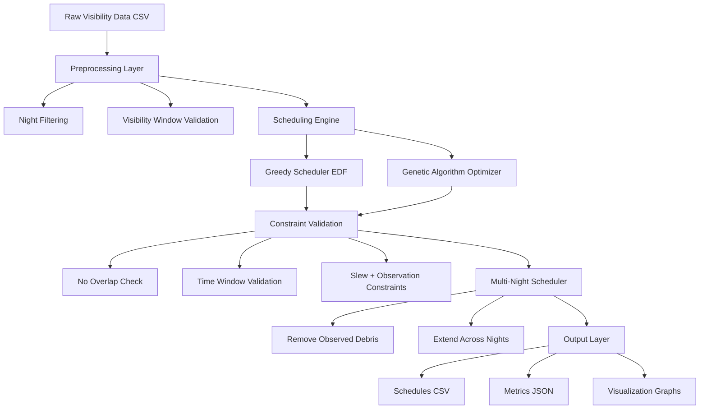
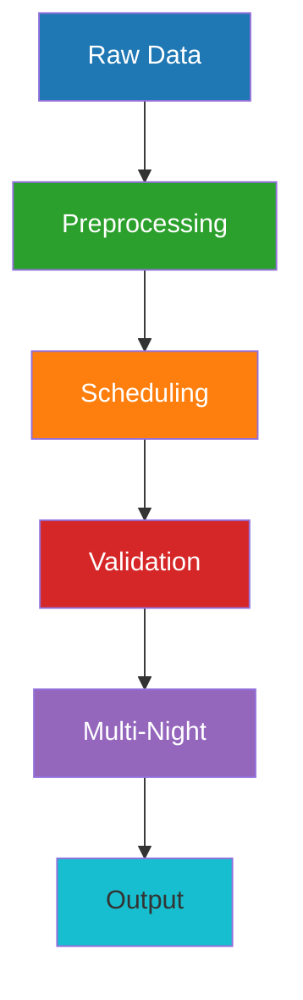
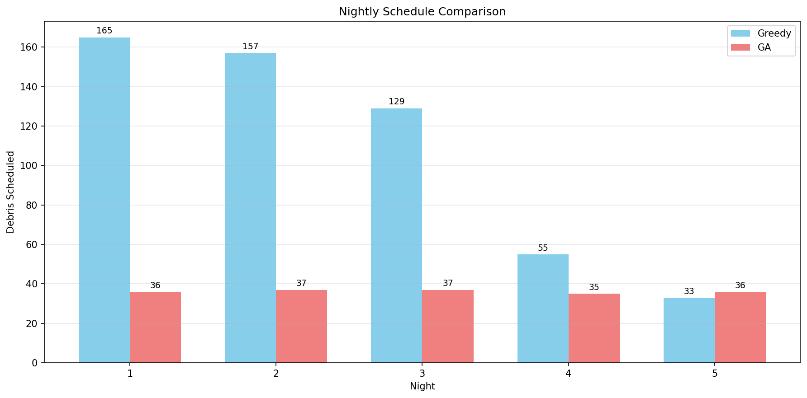

# 🚀 GEO Satellite Debris Observation Scheduling System

## 🔭 Overview
This project solves a **real operational problem in space systems**:

> How do you optimally schedule observations of hundreds of GEO debris objects using a **single ground-based telescope with strict physical limits?**

Unlike typical ML/demo projects, this system:
- Works under **real-world constraints**
- Models **actual telescope behavior**
- Reflects **ISRO/NASA-style scheduling pipelines**

---

## ⚠️ Real-World Challenge

Even if ~600 debris objects are visible:

👉 You can observe only ~166 per night

### Why?

- ⏱ Fixed observation time → 90 sec  
- 🔄 Telescope slew time → 120 sec  
- 🌙 Night-only operation  
- 🔒 Single telescope (no parallelism)

👉 This is a **hard physical limit**, not a software problem.

---

## 🧠 System Architecture

---

## ⚙️ Core Components

### 🔹 Greedy Scheduler (EDF)
- Strategy: Earliest Deadline First  
- Goal: Maximize throughput  
- Result:  
  ✔ ~165–166 observations/night (near physical limit)  
  ✔ Deterministic & fast

---

### 🔹 Genetic Algorithm Optimizer
- Representation: Permutation of debris order  
- Fitness:
  - Observation count  
  - Peak elevation (quality)  

✔ Explores **non-intuitive schedules**  
✔ Improves **observation quality**  
✔ Handles heavy overlap better  

---

### 🔹 Multi-Night Scheduler
- Runs scheduling across multiple nights  
- Removes already observed debris  
- Achieves **near-complete coverage**

✔ Reflects real mission planning workflows  

---

## 📊 Results

### 🔥 Key Insight

| Approach | Strength | Result |
|---|---|---|
| Greedy | Maximum throughput | ~166/night |
| GA | Better quality | Higher elevation |
| Combined | Real-world balance | Optimal scheduling |

---

### 📈 Scheduling Comparison

### 📌 Why does the Genetic Algorithm schedule fewer observations?

At first glance, the Genetic Algorithm (GA) schedules fewer debris compared to the Greedy approach. However, this is **intentional and reflects real-world operational trade-offs**.

- **Greedy (EDF)** prioritizes maximizing the number of observations  
  → Focus: **Quantity (throughput)**  
  → Result: Near physical limit (~166 observations/night)

- **Genetic Algorithm (GA)** optimizes for observation quality  
  → Focus: **Quality (higher peak elevation, better observation conditions)**  
  → Result: Fewer but more valuable observations

👉 In real space operations, not all observations are equal.  
Higher elevation observations provide:
- Better signal quality  
- Lower atmospheric distortion  
- More reliable measurements  

### 🔥 Key Insight:
This system demonstrates a fundamental trade-off:

👉 **Maximize quantity (Greedy) vs Optimize quality (GA)**

Both approaches are valid — the choice depends on mission objectives.

---

## 🧠 Engineering Highlights

- Modeled as **single-machine scheduling problem**
- Solved **NP-hard optimization problem**
- Enforced strict constraints:
  - No overlaps  
  - Fixed durations  
  - Real-time feasibility  
- Designed **simulation-based fitness evaluation**

---

## 🛠️ Tech Stack

- Python  
- Genetic Algorithms  
- Scheduling Algorithms (EDF)  
- Data Processing  
- Optimization Techniques  

---

## 📎 Project Summary

See: `project_summary.pdf`

---

## 🚀 Possible Extensions

- Multi-telescope scheduling  
- Weather-aware planning  
- Priority-based debris tracking  
- Real-time adaptive scheduling  

---

## 👩‍💻 Author

**Manasi Roshan Netrekar**

---

## ⭐ If this project interests you

Feel free to connect or reach out — always open to discussing space-tech, optimization, and real-world systems.